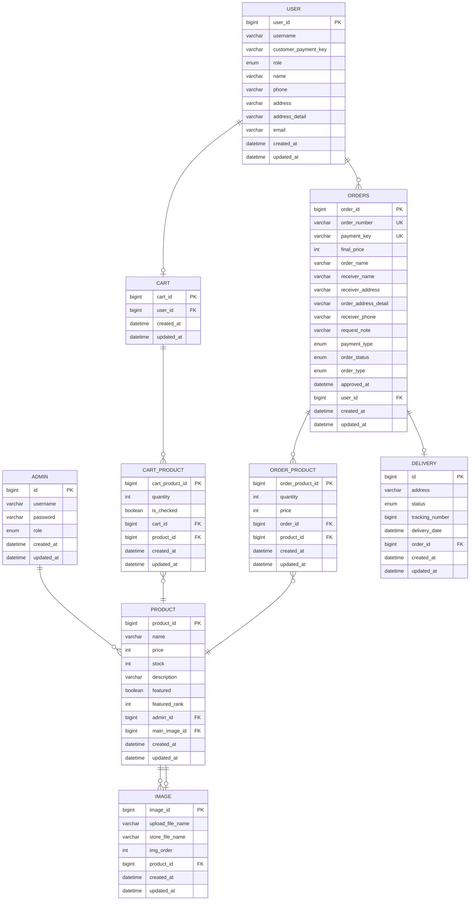

# Commerce

Spring Boot 기반 이커머스 플랫폼

## 기술 스택

- **Java 21** / **Spring Boot 3.5.6**
- **Spring Data JPA** + **MySQL 8.0**
- **Spring Security** + **OAuth2**
- **Redis 7.0** (캐싱, 분산 락)
- **AWS S3** (이미지 저장소)
- **Thymeleaf** (서버사이드 렌더링)
- **Prometheus / Grafana** (모니터링)
- **Terraform** (AWS 인프라 관리)
- **Docker Compose** (로컬 개발 환경)

## 외부 연동

- **Toss Payments** (결제)
- **Naver OAuth2** (소셜 로그인)

## 주요 기능

### 사용자
- OAuth2 소셜 로그인 (네이버)
- 상품 검색 (가격순, 판매량순 정렬 / 기간 필터링)
- 장바구니 (추가, 수량 변경, 선택/해제, 삭제)
- 주문 (장바구니 주문, 바로 구매)
- 결제 (Toss Payments 연동 - 카드, 가상계좌, 간편결제 등)
- 주문 취소 및 환불
- 주문 내역 조회

### 관리자
- 상품 등록/수정/삭제 (메인 이미지 + 서브 이미지)
- 주문 관리 및 배송 상태 업데이트
- 추천 상품 관리
- Redis 캐시 초기화


## ERD




### 환경 변수

| 변수 | 설명 |
|------|------|
| `SPRING_DATASOURCE_URL` | MySQL 접속 URL |
| `SPRING_DATASOURCE_USERNAME` | DB 사용자명 |
| `SPRING_DATASOURCE_PASSWORD` | DB 비밀번호 |
| `SPRING_DATA_REDIS_HOST` | Redis 호스트 |
| `AWS_S3_BUCKET` | S3 버킷명 |
| `NAVER_CLIENT_ID` | 네이버 OAuth 클라이언트 ID |
| `NAVER_CLIENT_SECRET` | 네이버 OAuth 클라이언트 시크릿 |
| `TOSS_SECRET_KEY` | Toss Payments 시크릿 키 |


## 트러블슈팅
 
### 1. N+1 쿼리 문제

#### 주문 목록 조회 (`GET /orders/list`)
- **문제**: OrderProduct, Product, Image마다 추가 쿼리 발생 → 요청당 27~28개 쿼리, timeout 다발
  - 80 VU 기준 실패율 81.63%, p95=60,000ms (timeout)
- **해결**: `JOIN FETCH`로 단일 쿼리 최적화 → 요청당 3개 쿼리
- **결과**:
  - 개선 전 (80 VU): 실패율 81.63%, order_list_duration p95=60,000ms
  - 개선 후 (100 VU): 실패율 0%, order_list_duration p95=12,186ms

#### 장바구니 조회 (`GET /cart`)
- **문제**: CartProduct마다 Product, Image 추가 쿼리 발생 → 요청당 5~23개 쿼리
  - 300 VU 기준 cart_duration p95=1,191ms
- **해결**: `JOIN FETCH` 최적화 → 요청당 4개 쿼리
- **결과**: p95 1,191ms → 19.9ms (약 98% 개선, 300 VU)

### 2. 주문 준비 N+1 쿼리 (`POST /pay/prepare`)
- **문제**: 장바구니 아이템 N개에 대해 INSERT·SELECT가 N번씩 발생
  - 50개 아이템 기준 INSERT max=101회, SELECT max=52회, prepare_duration p95=1,552ms
- **해결**: JDBC Batch INSERT + `IN` 절로 SELECT 일괄 조회 → INSERT 1회, SELECT 1회
- **결과**: p95 1,552ms → 96.6ms (약 94% 개선, 50개 아이템 / 300 VU)

### 3. 동시 주문 시 재고 정합성
- **문제**: 동시 주문 시 재고가 음수로 떨어지는 현상
- **해결**: JDBC `UPDATE ... WHERE stock >= qty` 단일 쿼리로 원자적 재고 차감, 실패 시 트랜잭션 롤백 (`UNION ALL`로 다건 상품 일괄 처리)
- **결과**: 동시 스레드 100 기준 avg 4,345ms → 1,012ms (약 76.7% 개선)

### 4. Batch Insert 데드락
- **문제**: 다건 주문 생성 시 INSERT 순서 차이로 데드락 발생 (SQL Error 1213)
  - 트랜잭션 A: 상품1→상품2 순 락 획득, 트랜잭션 B: 상품2→상품1 순 락 획득 → 순환 대기
  - POST /pay/confirm UPDATE 쿼리 31회 발행
- **해결**: product_id 기준 정렬 후 JDBC Batch INSERT (UPDATE 31회 → 1회)
- **결과**: p95 2,858ms → 1,959ms (100 VU, 상품 30개 기준, 약 31% 개선)

### 5. 주문 동시성 제어
- **문제**: 같은 주문에 대한 동시 취소/결제 요청 시 상태 불일치
- **해결**: `@Lock(PESSIMISTIC_WRITE)`로 주문 레코드 비관적 락 적용

### 6. DB 인덱스 최적화

#### 상품 가격 범위 검색 (`idx_product_price`)
- **문제**: 110K+ rows Full Table Scan (cost=14,269, actual time=39.8ms)
- **해결**: `price` 컬럼 단일 인덱스 추가 → Index Range Scan
- **결과**: cost 14,269 → 1,252 (91% 감소), actual time 39.8ms → 12.1ms (70% 개선)

#### 주문 내역 페이징 (`idx_order_user_create`)
- **문제**: `user_id` 인덱스로 50K rows 조회 후 `created_at DESC` filesort 발생 (actual time=50.7ms)
- **해결**: `(user_id, created_at)` 복합 인덱스 추가 → filesort 제거, 인덱스 역방향 스캔으로 정렬 대체
- **결과**: actual time 50.7ms → 0.105ms (약 483배 개선)

### 7. Redis 캐시 적용 (추천 상품)
- **문제**: 인기 상품 조회 시 매 요청마다 DB 직접 조회, 500 VU 기준 p95=1,280ms
- **해결**: Redis 캐시 적용 + 분산 락 + Double-Check 패턴으로 Cache Stampede 방지
- **결과**: 500 VU 기준 p95 1,280ms → 386ms (약 70% 개선)
- **부가**: TTL에 ±10% Jitter를 추가하여 Thundering Herd 방지

### 8. 쿼리 성능 모니터링
- **문제**: N+1 등 쿼리 성능 문제를 런타임에 감지하기 어려움
- **해결**: `StatementInspector' 로 요청별 쿼리 수를 카운트하고 Prometheus 메트릭으로 기록

## 프로젝트 구조

```
src/main/java/study/commerce/
├── controller/          # MVC 컨트롤러
│   └── admin/           # 관리자 컨트롤러
├── domain/              # JPA 엔티티
├── dto/                 # 요청/응답 DTO
├── repository/          # 데이터 접근 계층
├── service/             # 비즈니스 로직
└── support/             # 캐싱, 파일 저장소, 분산 락 등
```
